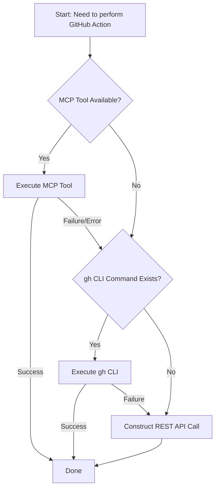

# Tool Escalation Ladder

This document defines the strict hierarchy for tool selection within the GitHub Skills ecosystem.

## 1. Primary: GitHub MCP Server

**Always attempt to use MCP tools first.**

- **Why**: They are optimized for agentic use, provide structured outputs, handle authentication automatically, and are faster than shelling out.
- **Coverage**: Issues, PRs, Comments, File Operations, Search.
- **Example**: Use `issue_read` instead of `gh issue view`.

## 2. Fallback: GitHub CLI (`gh`)

**Use only if an MCP tool is unavailable or fails.**

- **Why**: Robust, scriptable, and widely understood, but requires string parsing and shell execution.
- **Trigger**:
  - MCP tool returns a 500 or "not implemented" error.
  - Specific flag/option is missing from the MCP tool signature.
- **Example**: `gh pr create --fill` (if MCP `create_pull_request` is lacking specific auto-fill logic desired).

## 3. Last Resort: GitHub REST API

**Use only when absolutely necessary.**

- **Why**: Complex to construct, requires careful payload formatting, and verbose usage.
- **Trigger**:
  - Accessing "Early Access" features (e.g., custom metadata fields).
  - Complex queries not supported by `gh` or MCP.
  - Raw data inspection needed for debugging.
- **Example**: `curl -H "Accept: application/vnd.github.early-access+json" ...` for Issue Forms.

---

## Escalation Flowchart

