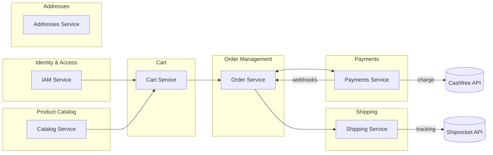

# 📘 Product Requirements Document (PRD)

**Version:** `1.0.0` | **Status:** `Draft`

## Table of Contents

1. Document Information
2. Governance & Workflow Gates
3. Feature Index (Living Blueprints)
4. Product Vision
5. Core Business Problem
6. Target Personas & Primary Use Cases
7. Business Value & Expected Outcomes
8. Success Metrics / KPIs
9. Ubiquitous Language (Glossary)
10. Architectural Overview (DDD – Mandatory)
11. Event Taxonomy Summary
12. Design System Strategy (MCP)
13. Feature Execution Flow
14. Repository Structure & File Standards
15. Feature Blueprint Standard (Stories & Gherkin Scenarios)
16. Traceability & Compliance Matrix
17. Non-Functional Requirements (NFRs)
18. Observability & Analytics Integration
19. Feature Flags Policy (Mandatory)
20. Security & Compliance
21. Risks / Assumptions / Constraints
22. Out of Scope
23. Rollout & Progressive Delivery
24. Appendix

---

## 1. Document Information

| Field              | Details                                    |
| ------------------ | ------------------------------------------ |
| **Document Title** | `itsme.fashion Strategic PRD`              |
| **File Location**  | `docs/product/PRD.md`                      |
| **Version**        | `1.0.0`                                    |
| **Date**           | `2025-12-30`                               |
| **Author(s)**      | `Product Team`                             |
| **Stakeholders**   | `Product, Engineering, Business Leadership`|

---

## 2. Governance & Workflow Gates

Delivery is enforced through **explicit workflow gates**.
Execution may be human-driven, agent-driven, or hybrid.

| Gate | Name                    | Owner                | Preconditions                             | Exit Criteria            |
| ---- | ----------------------- | -------------------- | ----------------------------------------- | ------------------------ |
| 1    | Strategic Alignment     | Product Architecture | Vision, context map defined               | Approval recorded        |
| 2    | Blueprint Bootstrapping | Planning Function    | Feature issues created, blueprints linked | Blueprint complete       |
| 3    | Technical Planning      | Engineering          | DDD mapping, flags defined                | Ready for implementation |
| 4    | Implementation          | Engineering          | Code + tests                              | CI green                 |
| 5    | Review                  | Engineering          | Preview deployed                          | Acceptance approved      |
| 6    | Release                 | Product / Ops        | All checks passed                         | Production approved      |

---

## 3. Feature Index (Living Blueprints)

*This section will be populated as features are defined through the roadmap and specification process.*

| Feature ID  | Title             | GitHub Issue  | Blueprint Path                      | Status           |
| ----------- | ----------------- | ------------- | ----------------------------------- | ---------------- |
| TBD         | TBD               | TBD           | TBD                                 | Draft            |

---

## 4. Product Vision

**itsme.fashion** empowers people to express their uniqueness with premium, clean, and cruelty-free beauty products delivered through a fast, trustworthy, and elegant shopping experience.

The platform democratizes access to ethical beauty by combining:
- Premium product quality emphasizing natural ingredients and ethical manufacturing
- Modern, mobile-first user experience that removes friction from discovery to delivery
- Transparent communication about product ingredients, sourcing, and brand values
- Trust through secure transactions, reliable fulfillment, and clear order tracking

itsme.fashion positions itself as the go-to destination for conscious consumers seeking beauty products that align with their values without compromising on quality or convenience.

---

## 5. Core Business Problem

Conscious consumers seeking premium beauty products face a fragmented, frustrating experience characterized by:

1. **Trust Deficit**: Difficulty verifying claims about natural ingredients, cruelty-free practices, and ethical manufacturing across multiple retailers
2. **Discovery Friction**: Time-consuming research across multiple platforms to find products that meet specific ingredient preferences and ethical criteria
3. **Inconsistent Experience**: Poor mobile experiences, slow checkout flows, and opaque order tracking create anxiety and abandonment
4. **Limited Assurance**: Uncertainty about product authenticity, ingredient safety, and brand values leads to purchase hesitation

Existing general-purpose ecommerce platforms lack the specialization, curation, and transparency required to serve this growing segment effectively. This creates an opportunity for a purpose-built platform that prioritizes ethical beauty, user trust, and seamless experience.

---

## 6. Target Personas & Primary Use Cases

| Persona                  | Description                                                                                  | Goals                                                                                     | Key Use Cases                                                                          |
| ------------------------ | -------------------------------------------------------------------------------------------- | ----------------------------------------------------------------------------------------- | -------------------------------------------------------------------------------------- |
| Conscious Beauty Seeker  | Age 25-45, values natural ingredients and ethical manufacturing, willing to pay premium      | Find trusted beauty products quickly, verify ingredient safety, support ethical brands    | Browse by category, filter by ethical markers, read ingredient lists, save favorites   |
| Mobile-First Shopper     | Primarily uses mobile devices, expects fast load times and intuitive navigation              | Complete purchases efficiently on mobile, track orders easily, manage shipping addresses  | Quick add-to-cart, mobile checkout, order status notifications                         |
| Repeat Customer          | Existing customer with established preferences and purchase history                          | Reorder favorite products quickly, discover new products aligned with preferences         | Wishlist management, reorder from history, personalized recommendations                |
| Gift Purchaser           | Buying beauty products as gifts, may be less familiar with specific products                 | Find popular/well-reviewed products, ensure timely delivery, manage multiple addresses    | Browse by popularity, gift recommendations, address book management                    |

---

## 7. Business Value & Expected Outcomes

| Outcome                         | Description                                                                                  | KPI Alignment      | Priority |
| ------------------------------- | -------------------------------------------------------------------------------------------- | ------------------ | -------- |
| Increased Conversion Rate       | Streamlined discovery and checkout reduce abandonment and increase purchase completion       | KPI-01, KPI-02     | High     |
| Higher Customer Lifetime Value  | Trust and convenience drive repeat purchases and customer loyalty                            | KPI-03, KPI-04     | High     |
| Reduced Support Costs           | Clear product information and order tracking minimize customer service inquiries             | KPI-05             | Medium   |
| Market Differentiation          | Purpose-built platform positions brand as category leader in ethical beauty ecommerce        | KPI-06             | High     |
| Mobile Revenue Growth           | Mobile-first design captures growing mobile commerce segment                                 | KPI-07             | High     |

---

## 8. Success Metrics / KPIs

| KPI ID  | Name                           | Definition                                                                | Baseline | Target  | Source         |
| ------- | ------------------------------ | ------------------------------------------------------------------------- | -------- | ------- | -------------- |
| KPI-01  | Conversion Rate                | (Purchases / Sessions) × 100                                              | 2.0%     | 4.5%    | GA4            |
| KPI-02  | Cart Abandonment Rate          | (Carts Created - Purchases) / Carts Created × 100                         | 70%      | 50%     | GA4            |
| KPI-03  | Repeat Purchase Rate           | (Customers with 2+ orders / Total customers) × 100                        | 15%      | 35%     | Internal DB    |
| KPI-04  | Customer Lifetime Value        | Average revenue per customer over 12 months                               | $150     | $400    | Internal DB    |
| KPI-05  | Support Ticket Volume          | Average support tickets per 100 orders                                    | 8        | 3       | Support System |
| KPI-06  | Net Promoter Score (NPS)       | (% Promoters - % Detractors)                                              | 20       | 50      | Survey         |
| KPI-07  | Mobile Revenue Percentage      | (Mobile revenue / Total revenue) × 100                                    | 45%      | 65%     | GA4            |
| KPI-08  | Order Fulfillment Success Rate | (Orders delivered on time / Total orders) × 100                           | 85%      | 95%     | Shiprocket     |
| KPI-09  | Payment Success Rate           | (Successful payments / Payment attempts) × 100                            | 92%      | 97%     | Cashfree       |
| KPI-10  | Page Load Time (Mobile)        | 75th percentile page load time on mobile                                  | 3.5s     | 1.5s    | OTEL           |

---

## 9. Ubiquitous Language (Glossary)

* **Product** — A distinct beauty item available for purchase (cosmetic, skin care, or hair care product)
* **Catalog** — The complete collection of products organized by category and ethical markers
* **Cart** — A server-side collection of products selected for purchase, persisted for 30 days for both authenticated and guest users
* **Wishlist** — A user's saved collection of products for future consideration (requires authentication, syncs across devices)
* **Order** — A confirmed purchase transaction with payment, shipping, and fulfillment details
* **Guest User** — An unauthenticated user identified by a guest token, can complete checkout without account creation
* **Ethical Marker** — Product attribute indicating third-party certified compliance with values (cruelty-free via Leaping Bunny, PETA vegan certification)
* **Bounded Context** — A logical domain boundary within the DDD architecture (IAM, Catalog, Cart, Order, Payment, Shipping, Addresses)
* **Aggregate** — A cluster of domain objects treated as a single unit for data changes
* **Event** — An immutable fact recording that something happened in the system
* **Command** — An intent to perform a state-changing operation
* **Query** — A request for data without side effects
* **Projection** — A denormalized read model derived from events
* **Feature Flag** — A runtime toggle controlling feature availability and behavior
* **Strong Consistency** — Immediate data consistency required for payment, order creation, and inventory deduction
* **Eventual Consistency** — Acceptable delayed consistency (< 1s) for catalog updates, wishlist sync, and order status

---

## 10. Architectural Overview (DDD — Mandatory)

### Bounded Contexts

| Context              | Purpose                                                                  | Core Aggregate     | Entities                        | Value Objects                           |
| -------------------- | ------------------------------------------------------------------------ | ------------------ | ------------------------------- | --------------------------------------- |
| IAM                  | Identity and access management, user authentication and authorization    | User               | User, Session                   | Email, Password, UserRole               |
| Catalog              | Product information, categorization, and discovery                       | Product            | Product, Category               | ProductId, SKU, Price, IngredientList   |
| Cart                 | Shopping cart management and session persistence                         | Cart               | Cart, CartItem                  | CartId, Quantity, SessionId             |
| Order                | Order lifecycle management from creation to completion                   | Order              | Order, OrderItem, OrderStatus   | OrderId, OrderState, Timestamp          |
| Payment              | Payment processing and transaction management                            | PaymentTransaction | PaymentTransaction, Refund      | TransactionId, Amount, PaymentMethod    |
| Shipping             | Shipping address management and shipment tracking                        | Shipment           | Shipment, TrackingEvent         | ShipmentId, TrackingNumber, Carrier     |
| Addresses            | User address management for shipping and billing                         | Address            | Address                         | AddressId, PostalCode, Country          |

### Context Relationships



---

## 11. Event Taxonomy Summary

| Event Name                 | Producer Context | Consumers                 | Trigger Aggregate      |
| -------------------------- | ---------------- | ------------------------- | ---------------------- |
| UserRegistered             | IAM              | Wishlist                  | User                   |
| UserAuthenticated          | IAM              | Cart, Order               | User                   |
| ProductAddedToCatalog      | Catalog          | Search Index              | Product                |
| ProductUpdated             | Catalog          | Cart, Search Index        | Product                |
| ProductBackInStock         | Catalog          | Wishlist, Notifications   | Product                |
| ItemAddedToCart            | Cart             | Analytics                 | Cart                   |
| ItemAddedToWishlist        | Cart             | Notifications             | Wishlist               |
| CartCheckedOut             | Cart             | Order                     | Cart                   |
| CartAbandoned              | Cart             | Notifications             | Cart                   |
| OrderCreated               | Order            | Payment, Shipping         | Order                  |
| OrderCancelled             | Order            | Payment, Inventory        | Order                  |
| PaymentInitiated           | Payment          | Order                     | PaymentTransaction     |
| PaymentCompleted           | Payment          | Order, Shipping           | PaymentTransaction     |
| PaymentFailed              | Payment          | Order, Notifications      | PaymentTransaction     |
| ShipmentCreated            | Shipping         | Order, Notifications      | Shipment               |
| TrackingNumberAssigned     | Shipping         | Order                     | Shipment               |
| ShipmentStatusUpdated      | Shipping         | Order                     | Shipment               |
| AddressAdded               | Addresses        | Order                     | Address                |

---

## 12. Design System Strategy (MCP)

All UI must use a **design system delivered via MCP**.

| Parameter         | Value                             |
| ----------------- | --------------------------------- |
| **MCP Server**    | `design-system-mcp`               |
| **Design System** | `itsme-fashion-design-system`     |

Raw HTML/CSS is prohibited unless explicitly approved in a Feature Blueprint.

**Design System Requirements:**
- Mobile-first responsive components
- Accessibility compliance (WCAG 2.1 AA)
- Consistent typography, spacing, and color tokens
- Pre-built components for common patterns (product cards, cart items, forms)

---

## 13. Feature Execution Flow

**Diagram Required**

* Format: **Mermaid**
* Location: `docs/diagrams/feature-execution-flow.md`

*To be generated during roadmap decomposition and feature specification phases.*

---

## 14. Repository Structure & File Standards

Source of truth is **GitHub**.

```text
/
├── .github/
│   ├── agents/           # Agent definitions
│   ├── skills/           # Agent skills
│   └── workflows/        # CI/CD workflows
├── docs/
│   ├── product/          # PRD, roadmap
│   ├── features/         # Feature specifications
│   ├── epics/            # Epic definitions
│   ├── execution/        # Execution flow documentation
│   └── diagrams/         # Mermaid diagrams
├── src/
│   ├── services/         # Bounded context services
│   │   ├── iam/
│   │   ├── catalog/
│   │   ├── cart/
│   │   ├── order/
│   │   ├── payment/
│   │   ├── shipping/
│   │   └── addresses/
│   ├── shared/           # Shared utilities and types
│   └── frontend/         # Lit web components
├── firebase.json
├── package.json
└── README.md
```

---

## 15. Feature Blueprint Standard

Each feature blueprint **must include**:

1. **Metadata** (issue URL, status)
2. **Deployment Plan** (Feature Flag defined)
3. **Stories (Vertical Slices)**
4. **Scenarios — Gherkin (Mandatory)**

### Gherkin Format

```gherkin
Given <initial context>
When <action>
Then <expected outcome>
```

All feature specifications must follow the canonical template located at:
`.github/skills/doc-feature-specification/assets/feature-spec.template.md`

---

## 16. Traceability & Compliance Matrix

*This section will be populated during feature specification and implementation phases.*

| Feature ID | Flag ID | Flag Key                                      | Bounded Context | Status     |
| ---------- | ------- | --------------------------------------------- | --------------- | ---------- |
| TBD        | TBD     | feature_fe_[feat]_fl_[flag]_[context]_enabled| TBD             | TBD        |

---

## 17. Non-Functional Requirements (NFRs)

| Metric                      | ID      | Target                      | Tool                  |
| --------------------------- | ------- | --------------------------- | --------------------- |
| Page Load Time (Mobile)     | NFR-01  | < 2s (75th percentile)      | OTEL, Lighthouse      |
| API Response Time           | NFR-02  | < 300ms (95th percentile)   | OTEL                  |
| Availability                | NFR-03  | 99.9% uptime                | Firebase Monitoring   |
| Concurrent Users            | NFR-04  | Support 10,000 simultaneous | Load Testing          |
| Data Consistency            | NFR-05  | Eventual consistency < 1s   | Event Store Metrics   |
| Mobile Responsiveness       | NFR-06  | Support 320px-2560px width  | Responsive Testing    |
| Accessibility               | NFR-07  | WCAG 2.1 AA compliance      | Axe, WAVE             |
| Browser Support             | NFR-08  | Chrome, Safari, Firefox, Edge (last 2 versions) | Cross-browser Testing |
| Payment Processing Time     | NFR-09  | < 5s end-to-end             | Cashfree Metrics      |
| Image Load Time             | NFR-10  | < 1s per product image      | Firebase Storage + CDN|

---

## 18. Observability & Analytics Integration

Mandatory tooling (parameterized):

* **Analytics:** `Google Analytics 4 (GA4)`
* **Telemetry:** `OpenTelemetry (OTEL)`
* Structured logs, metrics, and traces required

**Instrumentation Requirements:**
- All user interactions tracked (clicks, navigation, form submissions)
- All API requests instrumented with distributed tracing
- Business events logged (product views, cart additions, checkout starts, purchases)
- Error tracking with stack traces and context
- Performance metrics (Core Web Vitals, custom timing marks)

**Privacy & Compliance:**
- PII anonymization in logs and traces
- GDPR-compliant data retention policies
- User consent management for analytics cookies

---

## 19. Feature Flags Policy (Mandatory)

### Naming Convention (Enforced)

```
feature_fe_[feature_issue]_fl_[flag_issue]_[context]_enabled
```

**Example:**
```
feature_fe_42_fl_43_catalog_enabled
```

### Lifecycle

* Flags required for all features
* Flags removed after 100% rollout and validation (within 30 days of full release)
* Flag state changes logged and auditable

**Flag Categories:**
- **Temporary Release Flags**: Control progressive rollout (removed after full release)
- **Permanent Operational Flags**: Control optional features or experiments (retained)
- **Kill Switches**: Emergency feature disable capability (retained)

**Implementation:**
- Managed via Firebase Remote Config
- Server-side and client-side flag evaluation
- Default values defined in code for safety

---

## 20. Security & Compliance

**Authentication & Authorization:**
- Firebase Authentication with email/password
- JWT-based session management
- Role-based access control (RBAC) where applicable

**Data Protection:**
- All data at rest encrypted (Firestore native encryption)
- All data in transit encrypted (TLS 1.3+)
- PII identified and protected according to GDPR/CCPA requirements
- Payment card data never stored (handled by Cashfree PCI-compliant gateway)

**Input Validation:**
- All user inputs validated and sanitized
- GraphQL query depth and complexity limits enforced
- Rate limiting on all public endpoints

**Compliance Requirements:**
- GDPR compliance for EU users (consent, right to deletion, data portability)
- CCPA compliance for California users
- PCI DSS compliance via Cashfree gateway
- Cookie consent management

**Security Monitoring:**
- Failed authentication attempt tracking
- Anomaly detection for fraud prevention
- Regular security audits and penetration testing

---

## 21. Risks / Assumptions / Constraints

| Type       | Description                                                                                                      | Mitigation                                                                                  |
| ---------- | ---------------------------------------------------------------------------------------------------------------- | ------------------------------------------------------------------------------------------- |
| Risk       | Third-party payment gateway (Cashfree) downtime impacts order completion                                         | Implement retry logic, queue failed transactions, clear user communication                  |
| Risk       | Third-party shipping provider (Shiprocket) API reliability affects tracking accuracy                             | Cache tracking data, graceful degradation, manual tracking update capability                |
| Risk       | Mobile network variability affects user experience and conversion                                                | Aggressive performance optimization, offline-first capabilities, progressive enhancement    |
| Risk       | Product inventory data synchronization lag causes overselling                                                    | Real-time inventory checks at checkout, reservation system, clear backorder communication   |
| Assumption | Users have modern browsers (last 2 versions of major browsers)                                                   | Document browser requirements, test across supported browsers                               |
| Assumption | Firestore scaling characteristics meet performance requirements at projected scale                               | Load testing, monitoring, capacity planning with Firebase support                           |
| Assumption | Cashfree webhook delivery is reliable for payment status updates                                                 | Implement polling fallback, idempotent event handling, webhook retry monitoring             |
| Assumption | Initial market is US-only; data residency in us-central1 GCP region sufficient for launch                        | Design for future multi-region expansion, monitor international demand                      |
| Assumption | Ethical certifications from recognized third-party organizations (Leaping Bunny, PETA) are available for products| Validate certification availability with suppliers, establish fallback for uncertified products|
| Constraint | Firebase Cloud Functions cold start latency (up to 2s) may impact API response times                             | Keep critical functions warm, optimize bundle size, pre-warm on deployment                  |
| Constraint | GraphQL Mesh introduces additional latency layer between client and services                                     | Optimize mesh configuration, implement caching, monitor gateway performance                 |
| Constraint | Budget limitations require serverless architecture (no dedicated infrastructure)                                 | Design for Firebase/GCP serverless platform constraints, optimize for cost efficiency       |
| Constraint | Product inventory authority is external; itsme.fashion consumes near-real-time sync (< 5s lag acceptable)        | Cache inventory reads, validate at checkout, clear messaging on stock status                |

---

## 22. Out of Scope

The following capabilities are explicitly excluded from the initial product scope:

* **Multi-currency / International Shipping**: Initially supporting single currency (USD) and domestic US shipping only
* **User-Generated Content**: Product reviews, ratings, and user photos deferred to post-launch
* **Social Features**: User profiles, social sharing, wishlists sharing excluded
* **Subscription / Recurring Orders**: Subscription-based product delivery not supported initially
* **Affiliate / Referral Programs**: Marketing partnership features deferred
* **Mobile Native Apps**: Web-only initially; native iOS/Android apps out of scope
* **Live Chat Support**: Customer support via email only; live chat deferred
* **AR/VR Product Visualization**: Advanced product visualization features excluded
* **Loyalty Points / Rewards Program**: Customer loyalty programs deferred to phase 2
* **Gift Cards / Store Credit**: Alternative payment methods beyond Cashfree excluded
* **B2B / Wholesale Capabilities**: Focused exclusively on direct-to-consumer sales
* **Multi-vendor Marketplace**: Single brand/seller model; marketplace features excluded
* **Advanced Personalization**: ML-based product recommendations deferred
* **Inventory Management UI**: Product inventory synchronized from external system; no inventory management interface in itsme.fashion
* **Content Management System**: Product content managed directly via Firestore; no CMS UI
* **Order Splitting**: Single shipping address per order; multi-address gifting requires separate orders

---

## 23. Rollout & Progressive Delivery

**Phase 1: Internal Alpha** (Weeks 1-2)
- Internal team testing only
- Core user journeys validated (browse, cart, checkout, order tracking)
- Performance and security baseline established
- All critical bugs resolved before Beta

**Phase 2: Limited Beta** (Weeks 3-6)
- Invite-only access for 100-500 early adopters
- Feature flags enable gradual feature rollout
- Active monitoring and rapid iteration based on feedback
- Payment processing with real transactions (limited volume)
- Support processes validated

**Phase 3: General Availability** (Week 7+)
- Public launch with full feature set
- Progressive rollout to broader audience (10% → 50% → 100% over 2 weeks)
- Continued monitoring and optimization
- Feature flag cleanup (temporary flags removed)
- Full marketing and customer acquisition efforts

**Rollback Criteria:**
- Payment success rate < 90%
- Order fulfillment success rate < 80%
- Critical security vulnerability identified
- P0/P1 bugs affecting > 10% of users

**Monitoring During Rollout:**
- Real-time KPI dashboards (conversion, errors, performance)
- Automated alerts for anomalies
- Daily rollout review meetings
- User feedback collection and triage

---

## 24. Appendix

**References:**
- Firebase Documentation: https://firebase.google.com/docs
- Lit Framework: https://lit.dev
- GraphQL Mesh: https://the-guild.dev/graphql/mesh
- Cashfree Payment Gateway: https://www.cashfree.com
- Shiprocket Shipping Integration: https://www.shiprocket.in
- OpenTelemetry: https://opentelemetry.io
- DDD Reference: Domain-Driven Design by Eric Evans

**Supporting Documents:**
- Technology Stack Documentation: `itsme.md`
- Architecture Diagrams: `docs/diagrams/`
- Agent Skills Documentation: `.github/skills/`

**Glossary of Technical Terms:**
- **CQRS**: Command Query Responsibility Segregation - separating read and write operations
- **Event Sourcing**: Storing state changes as a sequence of events rather than current state
- **Aggregate**: A cluster of domain objects that can be treated as a single unit
- **Bounded Context**: A logical boundary within which a domain model is defined and applicable
- **GraphQL Mesh**: A gateway that composes multiple GraphQL services into a unified API
- **Firebase Cloud Functions**: Serverless compute platform for backend services
- **Firestore**: NoSQL document database with real-time synchronization
