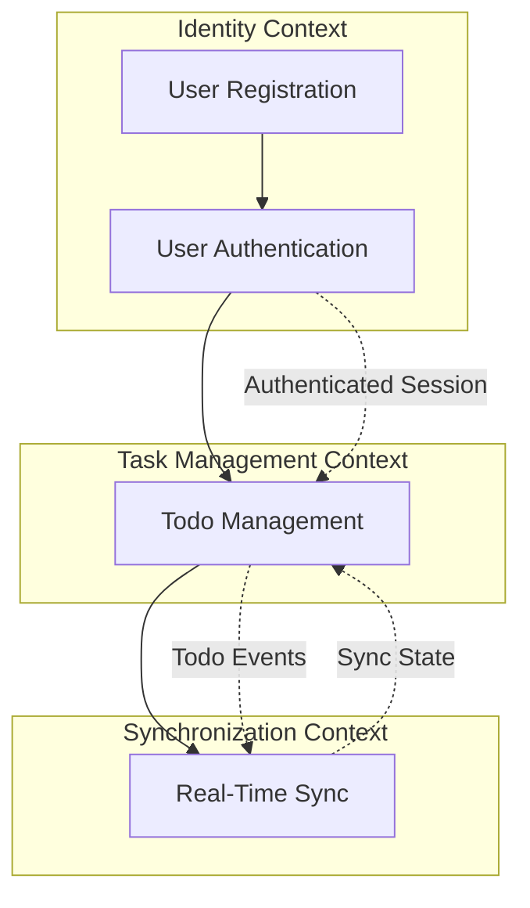

# 📘 Product Requirements Document (PRD)

**Version:** 1.1.0 | **Status:** In Review

## Table of Contents

1. Document Information
2. Governance & Workflow Gates
3. Feature Index (Living Blueprints)
4. Product Vision
5. Core Business Problem
6. Target Personas & Primary Use Cases
7. Business Value & Expected Outcomes
8. Success Metrics / KPIs
9. Ubiquitous Language (Glossary)
10. Architectural Overview (DDD – Mandatory)
11. Event Taxonomy Summary
12. Design System Strategy (MCP)
13. Feature Execution Flow
14. Repository Structure & File Standards
15. Feature Blueprint Standard (Stories & Gherkin Scenarios)
16. Traceability & Compliance Matrix
17. Non-Functional Requirements (NFRs)
18. Observability & Analytics Integration
19. Feature Flags Policy (Mandatory)
20. Security & Compliance
21. Risks / Assumptions / Constraints
22. Out of Scope
23. Rollout & Progressive Delivery
24. Appendix

---

## 1. Document Information

| Field              | Details                          |
| ------------------ | -------------------------------- |
| **Document Title** | Todo App with Auth & Sync - PRD  |
| **File Location**  | `docs/product/PRD.md`            |
| **Version**        | 1.1.0                            |
| **Date**           | 2026-01-06                       |
| **Author(s)**      | Product Team                     |
| **Stakeholders**   | Product, Engineering, Operations |

---

## 2. Governance & Workflow Gates

Delivery is enforced through **explicit workflow gates**.
Execution may be human-driven, agent-driven, or hybrid.

| Gate | Name                    | Owner                | Preconditions                             | Exit Criteria            |
| ---- | ----------------------- | -------------------- | ----------------------------------------- | ------------------------ |
| 1    | Strategic Alignment     | Product Architecture | Vision, context map defined               | Approval recorded        |
| 2    | Blueprint Bootstrapping | Planning Function    | Feature issues created, blueprints linked | Blueprint complete       |
| 3    | Technical Planning      | Engineering          | DDD mapping, flags defined                | Ready for implementation |
| 4    | Implementation          | Engineering          | Code + tests                              | CI green                 |
| 5    | Review                  | Engineering          | Preview deployed                          | Acceptance approved      |
| 6    | Release                 | Product / Ops        | All checks passed                         | Production approved      |

---

## 3. Feature Index (Living Blueprints)

| Feature ID | Title | GitHub Issue | Blueprint Path | Status |
| ---------- | ----- | ------------ | -------------- | ------ |
| TBD        | TBD   | TBD          | TBD            | Draft  |

---

## 4. Product Vision

Build a modern, reliable todo application that empowers users to manage their tasks effectively while providing seamless access across devices through authentication and real-time synchronization.

---

## 5. Core Business Problem

Users need a simple yet powerful way to track tasks across multiple devices without losing data or experiencing sync conflicts. Current solutions either lack real-time synchronization, require complex setup, or fail to provide secure user authentication. This creates friction in task management workflows and reduces productivity.

---

## 6. Target Personas & Primary Use Cases

| Persona               | Description                                | Goals                                                      | Key Use Cases                                                         |
| --------------------- | ------------------------------------------ | ---------------------------------------------------------- | --------------------------------------------------------------------- |
| Individual User       | Person managing personal tasks             | Track todos efficiently, access from any device            | Create tasks, mark complete, sync across devices                      |
| Mobile-First User     | User primarily accessing via mobile device | Quick task entry, offline capability, instant sync         | Add tasks on-the-go, view synced tasks, offline task management       |
| Multi-Device User     | User switching between desktop and mobile  | Consistent experience, automatic sync, no manual conflicts | Start task on desktop, complete on mobile, see real-time updates      |
| Privacy-Conscious User| User concerned about data security         | Secure authentication, data privacy, account isolation     | Create secure account, manage own data, trust authentication security |

---

## 7. Business Value & Expected Outcomes

| Outcome                           | Description                                                 | KPI Alignment | Priority |
| --------------------------------- | ----------------------------------------------------------- | ------------- | -------- |
| User Adoption                     | Enable users to quickly create accounts and start using app | KPI-1, KPI-2  | High     |
| Cross-Device Engagement           | Users actively use app on multiple devices                  | KPI-3, KPI-4  | High     |
| Real-Time Collaboration Readiness | Foundation for future team/sharing features                 | KPI-5         | Medium   |
| Data Integrity                    | Zero sync conflicts, consistent state across devices        | KPI-6         | High     |

---

## 8. Success Metrics / KPIs

| KPI ID | Name                      | Definition                                           | Baseline | Target | Source |
| ------ | ------------------------- | ---------------------------------------------------- | -------- | ------ | ------ |
| KPI-1  | User Registration Rate    | % of visitors who create accounts                    | 0%       | 35%    | GA4    |
| KPI-2  | Time to First Task        | Avg. time from signup to first task created          | N/A      | < 60s  | GA4    |
| KPI-3  | Multi-Device Usage        | % of users accessing from 2+ devices                 | 0%       | 40%    | GA4    |
| KPI-4  | Sync Latency              | Avg. time for task changes to sync across devices    | N/A      | < 2s   | OTEL   |
| KPI-5  | Weekly Active Users (WAU) | Users creating/completing at least 1 task per week   | 0        | TBD    | GA4    |
| KPI-6  | Sync Conflict Rate        | % of sync operations resulting in conflicts          | N/A      | < 0.1% | OTEL   |

---

## 9. Ubiquitous Language (Glossary)

* **Todo** — A single task item with title, completion status, metadata (due date, priority, notes, tags), and timestamps
* **User** — An authenticated account holder with unique credentials (email/password or OAuth)
* **Sync** — The process of propagating changes across all user devices via polling mechanism
* **Session** — An authenticated period with configurable duration based on user preference
* **Conflict** — A state where concurrent changes to the same todo are resolved via last-write-wins
* **Authentication** — The process of verifying user identity via email/password or OAuth providers (Google, GitHub)
* **Real-Time** — Changes visible across devices within 2 seconds under normal conditions (polling-based)
* **Device** — Any client (browser, mobile app) where the user accesses the application
* **Offline-First** — Full CRUD capability, registration, and login work without network connectivity
* **Sharing** — Ability to share individual todos with other users with edit permissions
* **Hybrid Sync** — Server validates changes, clients can operate offline with eventual consistency

---

## 10. Architectural Overview (DDD — Mandatory)

### Bounded Contexts

| Context             | Purpose                                  | Core Aggregate | Entities                | Value Objects                |
| ------------------- | ---------------------------------------- | -------------- | ----------------------- | ---------------------------- |
| Identity            | Multi-method authentication (email/password + OAuth) and account management with recovery | User           | User, Session, OAuthProvider | Email, Password, Token, OAuthToken |
| Task Management     | Todo CRUD with rich metadata (due date, priority, notes, tags, assigned user) and sharing | Todo           | Todo, TodoList, SharedTodo | Title, Status, DueDate, Priority, Tags, Notes |
| Synchronization     | Polling-based sync with hybrid authority and last-write-wins conflict resolution | SyncSession    | SyncEvent, SyncState    | DeviceId, ChangeVector, Hash, Timestamp |

---

## 11. Event Taxonomy Summary

| Event Name          | Producer Context | Consumers               | Trigger Aggregate |
| ------------------- | ---------------- | ----------------------- | ----------------- |
| UserRegistered      | Identity         | Task Management         | User              |
| UserAuthenticated   | Identity         | Task Management, Sync   | Session           |
| OAuthLinked         | Identity         | Task Management         | OAuthProvider     |
| PasswordResetRequested | Identity      | Task Management         | User              |
| TodoCreated         | Task Management  | Synchronization         | Todo              |
| TodoUpdated         | Task Management  | Synchronization         | Todo              |
| TodoDeleted         | Task Management  | Synchronization         | Todo              |
| TodoShared          | Task Management  | Synchronization         | SharedTodo        |
| SyncRequested       | Synchronization  | Task Management         | SyncSession       |
| SyncCompleted       | Synchronization  | Task Management         | SyncSession       |
| SyncFailed          | Synchronization  | Task Management         | SyncSession       |

---

## 12. Design System Strategy (MCP)

All UI must use a **design system delivered via MCP**.

| Parameter         | Value                     |
| ----------------- | ------------------------- |
| **MCP Server**    | `design-system-mcp`       |
| **Design System** | `material-components-web` |

Raw HTML/CSS is prohibited unless explicitly approved in a Feature Blueprint.

---

## 13. Feature Execution Flow

**Diagram Required**



---

## 14. Repository Structure & File Standards

Source of truth is **GitHub**.

```text
/
├── .github/
│   └── workflows/
├── docs/
│   ├── product/
│   │   └── PRD.md
│   ├── features/
│   └── diagrams/
├── src/
│   ├── identity/
│   ├── task-management/
│   └── synchronization/
├── tests/
│   ├── unit/
│   ├── integration/
│   └── e2e/
└── package.json
```

---

## 15. Feature Blueprint Standard

Each feature blueprint **must include**:

1. **Metadata** (issue URL, status)
2. **Deployment Plan** (Feature Flag defined)
3. **Stories (Vertical Slices)**
4. **Scenarios — Gherkin (Mandatory)**

### Gherkin Format

```gherkin
Given <initial context>
When <action>
Then <expected outcome>
```

---

## 16. Traceability & Compliance Matrix

| Feature ID | Flag ID | Flag Key | Bounded Context | Status |
| ---------- | ------- | -------- | --------------- | ------ |
| TBD        | TBD     | TBD      | TBD             | Draft  |

---

## 17. Non-Functional Requirements (NFRs)

| Metric                | ID     | Target             | Tool |
| --------------------- | ------ | ------------------ | ---- |
| Sync Latency (Polling)| NFR-1  | < 5 seconds (p95)  | OTEL |
| API Response Time     | NFR-2  | < 200ms (p95)      | OTEL |
| Offline Availability  | NFR-3  | 100% CRUD + auth   | OTEL |
| Data Durability       | NFR-4  | 99.99%             | OTEL |
| Concurrent Users      | NFR-5  | Support 10k users  | Load Testing |
| Authentication Time   | NFR-6  | < 500ms (p95)      | OTEL |
| OAuth Flow Time       | NFR-7  | < 3 seconds (p95)  | OTEL |
| Poll Interval         | NFR-8  | 2-5 seconds        | Config |

---

## 18. Observability & Analytics Integration

Mandatory tooling (parameterized):

* **Analytics:** Google Analytics 4 (GA4) — Anonymous analytics only, no consent required
* **Telemetry:** OpenTelemetry (OTEL)
* Structured logs, metrics, and traces required for all features
* Error tracking and alerting for sync failures
* User journey tracking for onboarding flow
* **Privacy Policy:** Anonymous analytics with no personally identifiable information (PII) collection

---

## 19. Feature Flags Policy (Mandatory)

### Naming Convention (Enforced)

```
feature_fe_[feature_issue]_fl_[flag_issue]_[context]_enabled
```

### Lifecycle

* Flags required for all features
* Flags removed after 100% rollout and validation
* Temporary flags for progressive rollout
* Permanent flags for A/B testing or user segmentation

---

## 20. Security & Compliance

* **Input Validation:** All user inputs sanitized and validated
* **Password Security:** Hashed with bcrypt (cost factor 12+)
* **OAuth Security:** Support for Google and GitHub OAuth providers with secure token storage
* **Session Management:** HTTP-only, secure cookies with CSRF protection, configurable duration per user
* **Password Recovery:** Email-based password reset with time-limited tokens
* **API Authentication:** JWT tokens with expiration and refresh mechanism
* **Data Encryption:** TLS 1.3 for data in transit
* **Access Control:** Complete data isolation per user, shared todos with explicit permissions
* **Rate Limiting:** Prevent brute force attacks on authentication endpoints
* **GDPR Compliance:** Immediate permanent deletion on user request, no data retention
* **Offline Security:** Encrypted local storage for offline authentication credentials

---

## 21. Risks / Assumptions / Constraints

| Type       | Description                                            | Mitigation                                                |
| ---------- | ------------------------------------------------------ | --------------------------------------------------------- |
| Risk       | Sync conflicts with concurrent edits                   | Last-write-wins strategy with timestamp-based resolution  |
| Risk       | Polling overhead with high user count                  | Adaptive poll intervals, efficient delta queries          |
| Risk       | Offline data loss if device lost before sync           | Acceptable risk, users warned about offline limitations   |
| Risk       | Sync failures due to network instability               | Show error banner, queue changes, allow offline usage     |
| Assumption | Users accept last-write-wins for conflict resolution   | Validated during clarifications                           |
| Assumption | Polling latency (2-5s) is acceptable for todo app      | Confirmed via requirements                                |
| Assumption | Users trust cloud storage for personal task data       | Anonymous analytics, immediate deletion on request        |
| Constraint | Limited to web platform initially                      | All major desktop/mobile browsers + tablets supported     |
| Constraint | Polling-based sync (not WebSocket/SSE)                 | Simpler implementation, acceptable latency for use case   |

---

## 22. Out of Scope

* Native mobile applications (iOS, Android) — Phase 2
* Team workspaces / organizations — Future consideration
* Rich text formatting in todo descriptions — Phase 2
* File attachments — Phase 2
* Recurring tasks / reminders — Phase 2
* Third-party integrations (calendar, email) — Future consideration
* Custom themes / UI personalization — Phase 2
* Subtasks / nested todos — Phase 2
* Advanced search / filtering — Phase 2
* Todo templates — Phase 2
* Bulk operations — Phase 2
* Export/import functionality — Phase 2

---

## 23. Rollout & Progressive Delivery

1. **Internal Alpha:** Development team and stakeholders (100 users max)
2. **Limited Beta:** Invited external users (500 users max, 30% feature flag)
3. **General Availability:** Public launch (100% rollout after beta validation)

Each phase includes:
* Monitoring sync performance and error rates
* Gathering user feedback
* Validating authentication security
* Measuring KPIs against targets

---

## 24. Appendix

### References

* [WebSocket vs SSE Comparison](https://example.com)
* [JWT Best Practices](https://example.com)
* [CRDT for Sync Conflict Resolution](https://example.com)

### Supporting Documents

* Technical Architecture Document (to be created)
* Security Review Checklist (to be created)
* API Specification (to be created)
