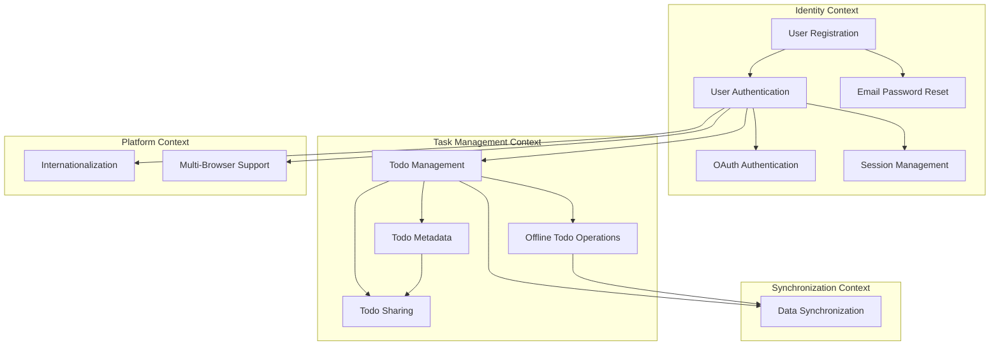

# Implementation Roadmap

**Version:** 1.0.0  
**Date:** 2026-01-06  
**Status:** Draft

## Feature Dependency Map

---

## Feature List

### Identity Context

#### User Registration

- **Description:** Enable users to create accounts with email and password
- **Depends on:** None
- **Bounded Context:** Identity

#### User Authentication

- **Description:** Verify user identity via email/password credentials
- **Depends on:** User Registration
- **Bounded Context:** Identity

#### OAuth Authentication

- **Description:** Enable users to authenticate using Google or GitHub OAuth providers
- **Depends on:** User Authentication
- **Bounded Context:** Identity

#### Email Password Reset

- **Description:** Allow users to recover account access via email-based password reset
- **Depends on:** User Registration
- **Bounded Context:** Identity

#### Session Management

- **Description:** Maintain authenticated user sessions with configurable duration
- **Depends on:** User Authentication
- **Bounded Context:** Identity

---

### Task Management Context

#### Todo Management

- **Description:** Enable users to create, read, update, and delete todos
- **Depends on:** User Authentication
- **Bounded Context:** Task Management

#### Todo Metadata

- **Description:** Support rich todo properties including due date, priority, notes, tags, and timestamps
- **Depends on:** Todo Management
- **Bounded Context:** Task Management

#### Todo Sharing

- **Description:** Allow users to share individual todos with other users with edit permissions
- **Depends on:** Todo Management, Todo Metadata
- **Bounded Context:** Task Management

#### Offline Todo Operations

- **Description:** Enable full CRUD operations, registration, and login without network connectivity
- **Depends on:** Todo Management
- **Bounded Context:** Task Management

---

### Synchronization Context

#### Data Synchronization

- **Description:** Propagate todo changes across all user devices via polling-based mechanism with hybrid authority and last-write-wins conflict resolution
- **Depends on:** Todo Management, Offline Todo Operations
- **Bounded Context:** Synchronization

---

### Platform Context

#### Internationalization

- **Description:** Support multiple languages from application launch
- **Depends on:** User Authentication
- **Bounded Context:** Platform

#### Multi-Browser Support

- **Description:** Ensure compatibility with Chrome, Firefox, Safari on desktop, mobile, and tablet devices
- **Depends on:** User Authentication
- **Bounded Context:** Platform

---

## Feature Execution Order

The following execution order reflects logical dependencies:

### Phase 1: Foundation (Identity Context)

1. User Registration
2. User Authentication
3. OAuth Authentication (parallel with Session Management and Email Password Reset)
4. Session Management (parallel with OAuth Authentication and Email Password Reset)
5. Email Password Reset (parallel with OAuth Authentication and Session Management)

### Phase 2: Core Functionality (Task Management Context)

6. Todo Management
7. Todo Metadata
8. Offline Todo Operations (parallel with Todo Sharing)
9. Todo Sharing (parallel with Offline Todo Operations)

### Phase 3: Synchronization (Synchronization Context)

10. Data Synchronization

### Phase 4: Platform (Platform Context)

11. Internationalization (parallel with Multi-Browser Support)
12. Multi-Browser Support (parallel with Internationalization)

---

## Notes

- **Parallelization:** Features within the same phase with no dependencies may be developed in parallel
- **Conflict Resolution:** Last-write-wins strategy is implemented in Data Synchronization feature
- **Data Isolation:** Complete data isolation per user is enforced across all features
- **Privacy:** Anonymous analytics with no consent required is implemented across all features
- **Bounded Contexts:** Features are grouped by DDD bounded contexts for organizational clarity
