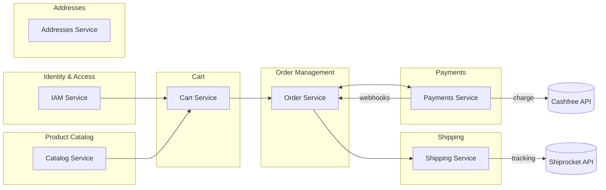

###  ITSME Readme

<details>


```markdown
# itsme.fashion - Premium Beauty Ecommerce Platform

<p align="center">
  <strong>A modern, scalable ecommerce platform for ethical beauty products</strong>
</p>

<p align="center">
  Built with Domain-Driven Design (DDD) | CQRS | Event Sourcing | Microservices
</p>

---

## 🌟 Overview

**itsme.fashion** is a user-friendly ecommerce platform offering **premium beauty
products**—including cosmetics, skin care, and hair care—that emphasize natural ingredients, ethical
manufacturing, and a bold, empowering brand tone.

### Product Vision

> Empower people to express their uniqueness with premium, clean, and cruelty-free beauty products
> delivered through a fast, trustworthy, and elegant shopping experience.

### Product Collection

- **Skin Care** - Herbal-infused formulas, no parabens, cruelty-free
- **Hair Care** - Nourishing collections for restoring shine
- **Cosmetics** - Compact powder, matte/liquid lipsticks, lip gloss, finishing powder
- All products focus on safe, natural ingredients and sustainable beauty

## ✨ Key Features

### User Experience

- 🔐 **User Authentication** - Email/password registration and login via Firebase Authentication
- 🛒 **Shopping Cart** - Add/update/remove items with session persistence
- ❤️ **Wishlist** - Save items for later (authenticated users)
- 🔍 **Product Discovery** - Category filtering, search, and sorting
- 📱 **Mobile-First** - Responsive design optimized for all devices

### Product Catalog

- 📦 **Rich Product Pages** - Descriptions, ingredient lists, usage tips
- 🌿 **Ethical Markers** - Cruelty-free, paraben-free, vegan badges
- 🏷️ **Categories** - Skin, hair, cosmetics organization
- 🖼️ **Product Images** - High-quality visuals with Firebase Storage

### Checkout & Payments

- 💳 **Secure Payments** - Cashfree payment gateway integration
- 📍 **Address Management** - Multiple shipping addresses support
- 🚚 **Shipping Options** - Carrier integration via Shiprocket
- 📧 **Order Confirmation** - Email notifications via Firebase extensions

### Order Management

- 📋 **Order History** - Complete order lifecycle tracking
- 🚀 **Shipment Tracking** - Real-time tracking link and status updates
- 🔔 **Status Notifications** - Webhook-driven order updates

---

## 🛠️ Technology Stack

### Frontend

| Component                | Technology           | Purpose          |
| ------------------------ | -------------------- | ---------------- |
| **Framework**            | Lit                  | Web Components   |
| **State Management**     | Preact Signals       | Reactive state   |
| **API Client**           | Native fetch         | GraphQL requests |
| **Internationalization** | lit-localize         | Frontend i18n    |
| **Deployment**           | Firebase App Hosting | Static hosting   |

### Backend

| Component          | Technology                         | Purpose                 |
| ------------------ | ---------------------------------- | ----------------------- |
| **Runtime**        | Node.js 22.x                       | Server runtime          |
| **Language**       | TypeScript 5.x                     | Type safety             |
| **Compute**        | Firebase Cloud Functions (2nd gen) | Serverless services     |
| **Database**       | Cloud Firestore                    | NoSQL document database |
| **Authentication** | Firebase Auth                      | User authentication     |
| **Storage**        | Firebase Storage                   | File/image storage      |

### API & Communication

| Component            | Technology       | Purpose                 |
| -------------------- | ---------------- | ----------------------- |
| **API Gateway**      | GraphQL Mesh     | Federation gateway      |
| **Subgraph Servers** | graphql-yoga     | Service GraphQL servers |
| **Schema Language**  | GraphQL SDL      | API schema definition   |
| **Events**           | Firestore Events | Domain event publishing |

### Build & Development

| Component           | Technology     | Purpose                     |
| ------------------- | -------------- | --------------------------- |
| **Package Manager** | npm workspaces | Monorepo management         |
| **Build Tool**      | esbuild        | TypeScript compilation      |
| **Task Runner**     | Wireit         | Monorepo task orchestration |
| **Code Formatting** | Prettier       | Code formatting             |
| **Linting**         | ESLint         | Code quality                |

### Testing & Quality

| Component         | Technology          | Purpose                |
| ----------------- | ------------------- | ---------------------- |
| **Test Runner**   | Node.js test runner | Unit/integration tests |
| **Assertions**    | node:assert/strict  | Test assertions        |
| **E2E Testing**   | Puppeteer           | Browser automation     |
| **Local Testing** | Firebase Emulators  | Development testing    |

### Infrastructure

| Component          | Technology             | Purpose            |
| ------------------ | ---------------------- | ------------------ |
| **Cloud Platform** | Google Cloud Platform  | Primary cloud      |
| **CI/CD**          | GitHub Actions         | Automation         |
| **Monitoring**     | OpenTelemetry          | Observability      |
| **Feature Flags**  | Firebase Remote Config | Feature management |

---

## 🏗️ Architecture

### Design Principles

The platform follows **Domain-Driven Design (DDD)** with **CQRS** (Command Query Responsibility
Segregation) and **Event Sourcing** patterns.

#### DDD Layering (per service)

```tree
src/services/<service>/
├── domain/           # Pure business logic (no external dependencies)
│   ├── aggregates    # Core domain entities
│   ├── events        # Domain events
│   └── value-objects # Immutable value types
├── application/      # Use cases and queries
│   ├── commands/     # Command handlers (mutations)
│   └── queries/      # Query handlers (reads)
└── infrastructure/   # External integrations
    ├── persistence/  # Firestore repositories
    ├── graphql/      # Schema and resolvers
    └── functions/    # Cloud Functions endpoints
```

#### CQRS Pattern

- **Command Side**: Mutates aggregates via domain events
- **Query Side**: Serves denormalized read models
- **Eventual Consistency**: Read models updated via projectors

#### Bounded Contexts



### API Topology

| Type               | Purpose                         | Entry Point          |
| ------------------ | ------------------------------- | -------------------- |
| **GraphQL (App)**  | Client reads/writes             | GraphQL Mesh Gateway |
| **HTTP Functions** | Webhooks, health checks, events | Direct invocation    |

- Each service exposes a `*_graphql` function serving a GraphQL subgraph
- Mesh gateway composes all subgraphs into one unified endpoint
- HTTP functions handle webhooks (PSP, carriers), health checks, and projectors

---

## 🙏 Acknowledgments

- [Firebase](https://firebase.google.com) - Backend infrastructure
- [Lit](https://lit.dev) - Web Components framework
- [GraphQL Mesh](https://the-guild.dev/graphql/mesh) - API gateway
- [Cashfree](https://www.cashfree.com) - Payment processing
- [Shiprocket](https://www.shiprocket.in) - Shipping integration

---


```
</details>